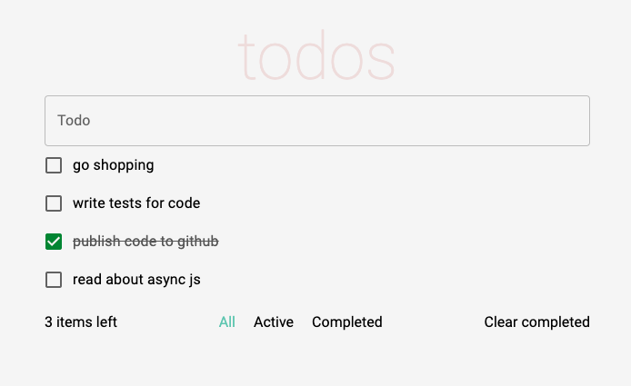

# Mindbox Frontend Test

Тестовое задание на позицию Frontend Developer Intern для компании mindbox

### Оглавление

- [Обзор](#обзор)
  - [Задание](#задание)
  - [Скриншот](#скриншот)
  - [Ссылки](#ссылки)
- [Разработка](#разработка)
  - [Инструменты](#инструменты)
  - [Todo](#todo)
- [Автор](#автор)

## Обзор

### Задание

Пользователи могут:

- добавлять новые задачи
- фильтровать задачи по статусу
- чистить список от отмеченных задач

### Скриншот

### Ссылки

[Live Website](https://davidbraginsky.github.io/mindbox_frontend_test/)

## Разработка

### Инструменты

- React (18.1)
- Context API
- SCSS
- ESLint
- Material UI
- uuid

Для того, чтобы запустить приложение локально склонируйте репозиторий. После установите все зависимости при помощи `npm install`. Запустите приложение при помощи `npm run serve`.

### Todo

- добавить анимации при добавлении новой задачи

## Автор

[@davidbraginsky](https://github.com/davidbraginsky)
